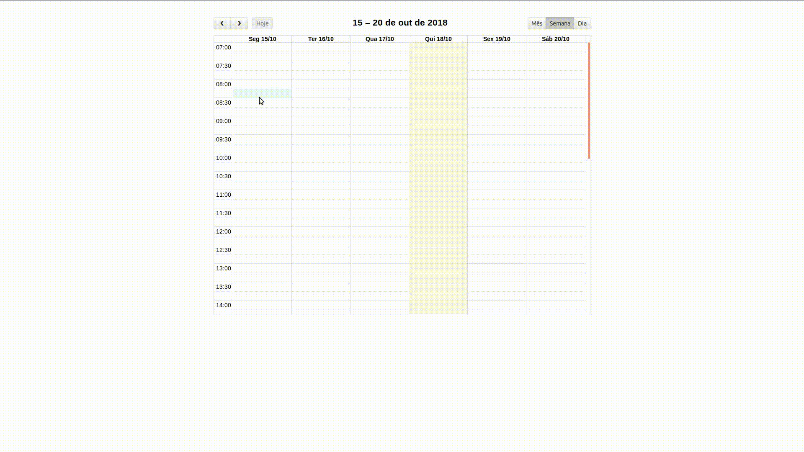

# fullcalendarSimpleConfig
Exemplo básico de uso customizado do fullcalendar

## Bug

When I inicialize the calendar I see the agenda view, but when I add some events and change the agenda view to other view, then the events aren't load.

This just happen on the first interaction, after that the events are rendered just fine.

## Funcionalidades
 - Visualizações em mês, semana e dia
 - Clicando em um dia do mês muda-se a visualização para o dia
 - Adiciona-se e remove-se dinamicamente eventos ao calendário

## Rodando

` npm install ` 

` npm run build `

` npm run watch `

